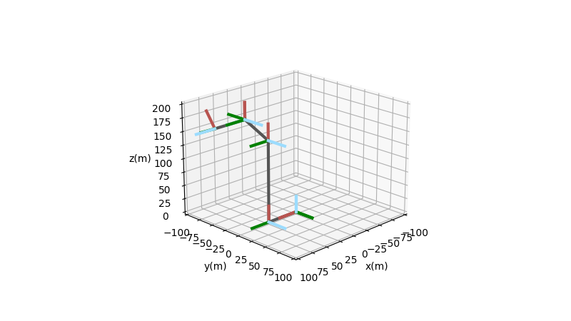
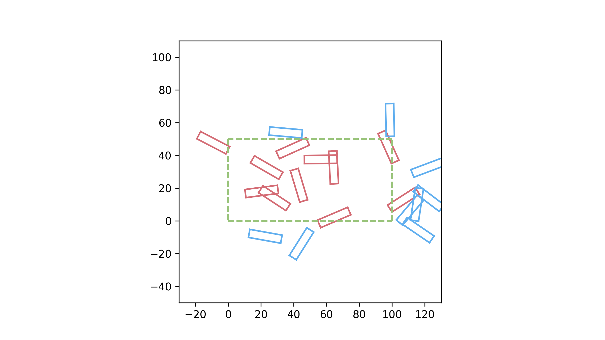

# 开源机器人学

您好，这是一个帮助机器人学习者入门的开源项目，我会在本项目更新以下内容：

1. 机器人学基础知识点的实现
2. 实用且有趣的算法实现

需要特别指出，本项目的开发要遵循几个原则：

1. **单文件原则**：除了必要的 python 基础模块外，每个实例仅依赖于单个文件的内容
2. **索引原则**：这不是一份教学材料，附带的文档中固然可以简单讲解算法，但更重要的是为初学者指明有价值的参考资料

本项目将持续更新，感谢您的关注~

## 目录

- 刚体运动
  - [旋转矩阵 欧拉角 四元数的转换](#旋转矩阵-欧拉角-四元数的转换)
  - [齐次变换矩阵的建立与转换](#齐次变换矩阵的建立与变换)
  - [计算多刚体机构的自由度](#计算多刚体机构的自由度)
- 机器人运动学
  - [DH 参数表可视化](#DH参数表可视化)
  - DH参数与PoE（指数积）的相互转换
- 几何学
  - [平面碰撞检测](#平面碰撞检测)

## 刚体运动

### 旋转矩阵 欧拉角 四元数的转换

[查看实例](src/rotation_matrix/)

旋转矩阵是最基本的姿态表达方法。本文件包含了以下与旋转矩阵有关的算法：

1. 欧拉角与旋转矩阵互相转换
2. 四元数与旋转矩阵互相转换

可以按照类似如下方法调用：

```python
euler_init = [10, 45, 90]
R = euler_to_rotmat(euler_init)

print('初始欧拉角: ')
print(euler_init)
print('\n欧拉角 -> 旋转矩阵: ')
print(R)
```

将得到如下结果：

```shell
初始欧拉角:
[10, 45, 90]

欧拉角 -> 旋转矩阵:
[[ 0.     -0.9848  0.1736]
 [ 0.7071  0.1228  0.6964]
 [-0.7071  0.1228  0.6964]]
```

## 机器人运动学

### DH 参数表可视化

[查看实例](src/dh_view/)

D-H 法是研究机器人学经常要用到的工具。本文件可以根据给出的 DH 表生成对应的 3 维坐标系结构简图。支持标准 DH(SDH)和改进 DH(MDH)。

可以按照类似如下方法调用：

```python
# 标准六轴
# MDH参数表  a   alpha    d   theta
dh_list = [[0,     0,     0,    0],
           [50,  -90,     0,  -90],
           [150,   0,     0,    0],
           [50,  -90,    40,    0],
           [0,    90,     0,    0],
           [0,   -90,    50,   30]]
dh_view(dh_list, dh_type="mdh")
```

将得到如下结果：



## 几何学

### 平面碰撞检测

[查看实例](./src/collision_detection)

对于空间中任意两个凸多边形，可以采用一种名为**分离轴测试**（Separating Axis Test）的方法进行碰撞检测。本文件包含一组矩形的例子：


